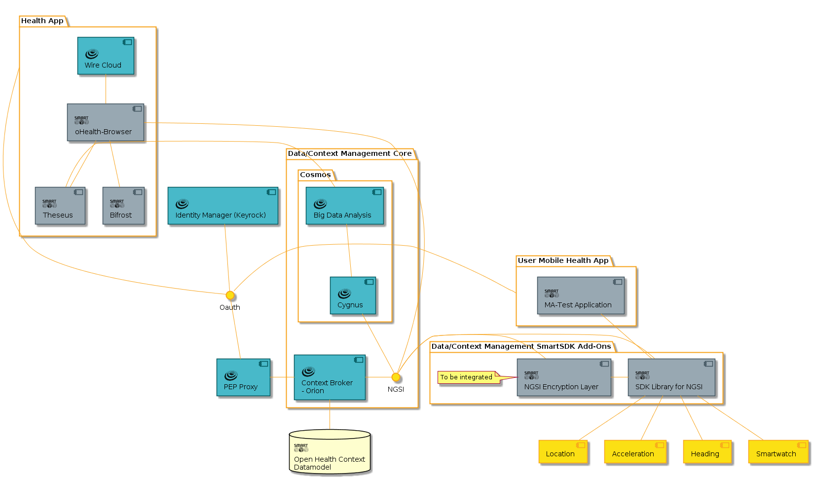

# Architecture

The architecture the most common services required in terms of a data sensing application.  

Please note that the mobile applications is to be used as tools to collect mobile devices sensor-data (e.g., accelerometer, orientation) while patients perform a set of physical activities. The generated applications are meant to be installed in a smartphone / smartwatch that will be worn by the participant. 

In this context, data has been collected on each device and will eventually sent to FIWARE Cloud by calling respective RESTful verbs. Data will connect to Orion Context Broker through the PEP component (Police Enforcement Point), which will invoke a filter mechanism to ensure that only expected data will be analyzed. Once data has been stored into Cosmos Big Data GE and processed by Theseus (a component that analyzes small amounts of data), data is then retrieved using Bifrost; which serves as an broker that transports query parameters from the Wirecloud GE. Finally, data retrieved from the Cosmos GE, it is sent back to Bifrost in order to be displayed on their corresponding  widgets.

The Scenario’s main contributions focus on three components:

**Theseus.** A python-based implementation of open-source software to facilitate the analysis of data. It doesn’t try to compete with the available Data Analytic GE, but to complement it for quick prototyping purposes by using public libraries, such as SciPy.

**Bifrost.** A software implementation  developed on python using the Flink framework  to connect widgets with historical data components. Bifrost serves as a broker that transports query parameters from the Wirecloud GE to the Cosmos GE through an interpreter (analogically illustrated as a bridge). Once data is retrieved from the Cosmos GE, it is sent to the bridge, and then the data is parsed into NGSI format and sent back to the Wirecloud GE; so it can be displayed over corresponding widgets. 

Source code can be find in GitHub: [Bifrost](https://github.com/netzahdzc/Bifrost/tree/master/Bifrost)

**oHealth-Browser.** A software widget developed to handle three different modules: Participants, Physical test, and Parameters of Interest. Altogether, functions are built into a single component which can be extended in order to cover a wider range of services. The GUI is personalized based on basic information, such as the IP address of the remote service (e.g., Cosmos or a third party server), Module of service (i.e., Participants, PhysicalTest, or ParameterOfInteres), and Attributes to retrieve, among others.

Source code can be find in GitHub: [oHealth-Browser](https://github.com/netzahdzc/Bifrost/tree/master/oHealthCxt-Browser)

